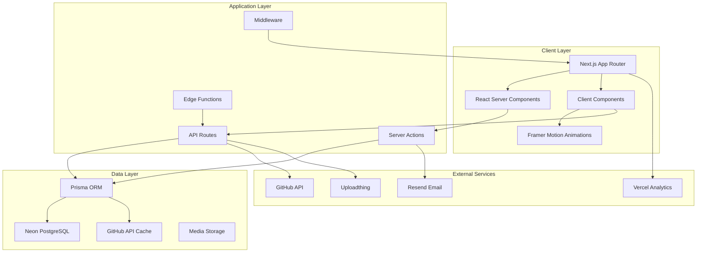

# Design Document

## Overview

The Brutalist Developer Portfolio is a sophisticated Next.js 14 full-stack application that combines raw industrial aesthetics with cutting-edge web technologies. The design philosophy centers on "digital concrete" - creating an experience that feels both brutally honest and technically masterful.

The application architecture leverages Next.js App Router with Server Components for optimal performance, implements a comprehensive design system based on brutalist principles, and provides enterprise-level functionality through strategic technology integration. The portfolio serves dual purposes: showcasing technical expertise and converting visitors into clients through deliberate user experience design.

## Architecture

### High-Level System Architecture



### Technology Stack Integration

**Frontend Architecture:**

- Next.js 14 with App Router for file-based routing and server-side rendering
- React Server Components for data fetching and static content rendering
- Client Components for interactive features and animations
- TypeScript for type safety and developer experience
- Tailwind CSS with custom brutalist design system configuration
- Framer Motion for sophisticated animations and transitions

**Backend Architecture:**

- Next.js Server Actions for form handling and data mutations
- API Routes for third-party integrations and webhooks
- Edge Functions for global performance optimization
- Middleware for authentication, rate limiting, and request processing

**Database Architecture:**

- Neon PostgreSQL with connection pooling for scalability
- Prisma ORM with type-safe database operations
- Optimistic updates and intelligent caching strategies
- Real-time data synchronization with external APIs

**External Integrations:**

- GitHub API via Octokit for repository and contribution data
- Resend for transactional email with custom templates
- Uploadthing for media management and optimization
- Vercel Analytics for performance and user behavior tracking

## Components and Interfaces

### Design System Components

**Core UI Primitives:**

```typescript
// Brutalist Button Component Interface
interface BrutalistButtonProps {
  variant: "primary" | "secondary" | "accent" | "ghost";
  size: "sm" | "md" | "lg" | "xl";
  isLoading?: boolean;
  isDisabled?: boolean;
  children: React.ReactNode;
  onClick?: () => void;
  className?: string;
}

// Brutalist Card Component Interface
interface BrutalistCardProps {
  variant: "default" | "elevated" | "interactive" | "accent";
  padding: "none" | "sm" | "md" | "lg";
  border: boolean;
  hover?: "lift" | "glow" | "invert" | "none";
  children: React.ReactNode;
  className?: string;
}
```

**Typography System:**

```typescript
// Typography Component Interface
interface TypographyProps {
  variant: "display" | "h1" | "h2" | "h3" | "h4" | "body" | "caption" | "code";
  weight: "normal" | "bold";
  transform: "none" | "uppercase" | "lowercase";
  spacing: "tight" | "normal" | "wide";
  children: React.ReactNode;
  className?: string;
}
```

### Layout Components

**Header System:**

```typescript
interface MainHeaderProps {
  isScrolled: boolean;
  currentPath: string;
  isMenuOpen: boolean;
  onMenuToggle: () => void;
}

interface NavigationProps {
  items: NavigationItem[];
  currentPath: string;
  isMobile: boolean;
}
```

**Footer System:**

```typescript
interface MainFooterProps {
  socialLinks: SocialLink[];
  quickLinks: QuickLink[];
  contactInfo: ContactInfo;
  newsletterEnabled: boolean;
}
```

### Feature Components

**GitHub Integration:**

```typescript
interface GitHubDashboardProps {
  username: string;
  repositories: Repository[];
  contributionData: ContributionData;
  activityFeed: ActivityItem[];
  languageStats: LanguageStats;
}

interface ContributionGraphProps {
  data: ContributionData;
  theme: "brutalist";
  interactive: boolean;
  showTooltips: boolean;
}
```

**Project Showcase:**

```typescript
interface ProjectGridProps {
  projects: Project[];
  filters: ProjectFilter[];
  sortBy: SortOption;
  viewMode: "grid" | "list" | "masonry";
  onFilterChange: (filters: ProjectFilter[]) => void;
}

interface ProjectCardProps {
  project: Project;
  variant: "compact" | "detailed" | "featured";
  showMetrics: boolean;
  interactive: boolean;
}
```

**Animation System:**

```typescript
interface AnimationWrapperProps {
  type: "fadeIn" | "slideIn" | "scaleIn" | "stagger";
  direction?: "up" | "down" | "left" | "right";
  delay?: number;
  duration?: number;
  children: React.ReactNode;
}

interface ScrollTriggerProps {
  threshold: number;
  rootMargin: string;
  triggerOnce: boolean;
  children: React.ReactNode;
  onIntersect: () => void;
}
```

## Data Models

### Core Database Schema

```prisma
// User Management
model User {
  id        String   @id @default(cuid())
  email     String   @unique
  name      String?
  role      Role     @default(USER)
  createdAt DateTime @default(now())
  updatedAt DateTime @updatedAt

  // Relations
  projects     Project[]
  blogPosts    BlogPost[]
  testimonials Testimonial[]

  @@map("users")
}

// Project Management
model Project {
  id          String   @id @default(cuid())
  title       String
  slug        String   @unique
  description String
  content     String?

  // Technical Details
  technologies String[]
  githubUrl    String?
  liveUrl      String?
  status       ProjectStatus @default(ACTIVE)
  featured     Boolean       @default(false)

  // Media
  thumbnail    String?
  images       String[]
  videoUrl     String?

  // Metrics
  viewCount    Int @default(0)
  likeCount    Int @default(0)

  // Metadata
  createdAt DateTime @default(now())
  updatedAt DateTime @updatedAt
  publishedAt DateTime?

  // Relations
  authorId String
  author   User   @relation(fields: [authorId], references: [id])

  categories ProjectCategory[]
  analytics  ProjectAnalytics[]

  @@map("projects")
}

// Blog System
model BlogPost {
  id          String   @id @default(cuid())
  title       String
  slug        String   @unique
  excerpt     String?
  content     String

  // SEO
  metaTitle       String?
  metaDescription String?
  ogImage         String?

  // Publishing
  status      PostStatus @default(DRAFT)
  featured    Boolean    @default(false)
  publishedAt DateTime?

  // Engagement
  viewCount   Int @default(0)
  readingTime Int @default(0)

  // Metadata
  createdAt DateTime @default(now())
  updatedAt DateTime @updatedAt

  // Relations
  authorId String
  author   User   @relation(fields: [authorId], references: [id])

  categories BlogCategory[]
  tags       BlogTag[]
  analytics  BlogAnalytics[]

  @@map("blog_posts")
}

// GitHub Integration
model GitHubRepository {
  id          String   @id @default(cuid())
  githubId    Int      @unique
  name        String
  fullName    String
  description String?

  // Repository Data
  language     String?
  starCount    Int @default(0)
  forkCount    Int @default(0)
  watcherCount Int @default(0)

  // URLs
  htmlUrl  String
  cloneUrl String

  // Metadata
  isPrivate   Boolean   @default(false)
  isFork      Boolean   @default(false)
  isArchived  Boolean   @default(false)
  createdAt   DateTime
  updatedAt   DateTime
  pushedAt    DateTime?
  lastSyncAt  DateTime  @default(now())

  // Relations
  contributions GitHubContribution[]

  @@map("github_repositories")
}

// Analytics System
model PageView {
  id        String   @id @default(cuid())
  path      String
  userAgent String?
  referer   String?
  country   String?
  city      String?

  // Session Data
  sessionId String
  userId    String?

  // Metadata
  createdAt DateTime @default(now())

  @@map("page_views")
}

// Testimonials
model Testimonial {
  id      String @id @default(cuid())
  name    String
  role    String
  company String?

  // Content
  content   String
  rating    Int    @default(5)
  videoUrl  String?
  avatarUrl String?

  // Display
  featured Boolean @default(false)
  approved Boolean @default(false)

  // Metadata
  createdAt DateTime @default(now())
  updatedAt DateTime @updatedAt

  // Relations
  authorId  String?
  author    User?    @relation(fields: [authorId], references: [id])
  projectId String?

  @@map("testimonials")
}

// Contact Management
model ContactSubmission {
  id      String      @id @default(cuid())
  name    String
  email   String
  subject String?
  message String
  type    ContactType @default(GENERAL)

  // Project Details (for project inquiries)
  projectType String?
  budget      String?
  timeline    String?

  // Status
  status    ContactStatus @default(NEW)
  responded Boolean       @default(false)

  // Metadata
  createdAt DateTime @default(now())
  updatedAt DateTime @updatedAt

  @@map("contact_submissions")
}

// Enums
enum Role {
  USER
  ADMIN
}

enum ProjectStatus {
  DRAFT
  ACTIVE
  ARCHIVED
  FEATURED
}

enum PostStatus {
  DRAFT
  PUBLISHED
  SCHEDULED
  ARCHIVED
}

enum ContactType {
  GENERAL
  PROJECT_INQUIRY
  CONSULTATION
  COLLABORATION
  SUPPORT
}

enum ContactStatus {
  NEW
  IN_PROGRESS
  RESPONDED
  CLOSED
}
```

### GitHub Data Integration

**Contribution Data Structure:**

```typescript
interface ContributionData {
  totalContributions: number;
  weeks: ContributionWeek[];
  contributionCalendar: ContributionDay[];
  longestStreak: number;
  currentStreak: number;
}

interface ContributionWeek {
  contributionDays: ContributionDay[];
  firstDay: string;
}

interface ContributionDay {
  contributionCount: number;
  date: string;
  contributionLevel:
    | "NONE"
    | "FIRST_QUARTILE"
    | "SECOND_QUARTILE"
    | "THIRD_QUARTILE"
    | "FOURTH_QUARTILE";
}
```

**Repository Analytics:**

```typescript
interface RepositoryMetrics {
  id: string;
  name: string;
  description: string;
  language: string;
  starCount: number;
  forkCount: number;
  watcherCount: number;
  lastCommit: Date;
  commitCount: number;
  contributors: number;
  codeFrequency: CodeFrequencyData[];
  languageBreakdown: LanguageStats;
}
```

## Error Handling

### Error Boundary Strategy

**Global Error Handling:**

```typescript
interface ErrorBoundaryProps {
  fallback: React.ComponentType<ErrorFallbackProps>;
  onError?: (error: Error, errorInfo: ErrorInfo) => void;
  children: React.ReactNode;
}

interface ErrorFallbackProps {
  error: Error;
  resetError: () => void;
  hasError: boolean;
}
```

**API Error Handling:**

```typescript
interface APIError {
  code: string;
  message: string;
  details?: Record<string, any>;
  timestamp: Date;
  requestId: string;
}

interface ErrorResponse {
  success: false;
  error: APIError;
  statusCode: number;
}
```

**Form Validation Errors:**

```typescript
interface ValidationError {
  field: string;
  message: string;
  code: string;
}

interface FormErrors {
  [key: string]: ValidationError[];
}
```

### Graceful Degradation

**GitHub API Fallbacks:**

- Cache GitHub data locally with 24-hour refresh cycles
- Display cached data when API limits are reached
- Show placeholder content for missing repository data
- Implement retry logic with exponential backoff

**Image Loading Fallbacks:**

- Progressive image loading with blur placeholders
- Fallback to optimized WebP/AVIF formats
- Skeleton loading states for missing images
- Error boundaries for broken image URLs

**Animation Fallbacks:**

- Respect `prefers-reduced-motion` user preferences
- Provide static alternatives for complex animations
- Graceful degradation for older browsers
- Performance-based animation scaling

## Testing Strategy

### Testing Pyramid Architecture

**Unit Testing (70%):**

- Component rendering and prop handling
- Utility function logic and edge cases
- Database query functions and data transformations
- Form validation and error handling
- Animation hook behavior and state management

**Integration Testing (20%):**

- API route functionality and error responses
- Database operations and data consistency
- GitHub API integration and caching
- Email service integration and template rendering
- Authentication flows and session management

**End-to-End Testing (10%):**

- Complete user journeys from landing to conversion
- Admin dashboard functionality and content management
- Form submissions and email notifications
- Project showcase filtering and search
- Mobile responsiveness and touch interactions

### Testing Tools and Configuration

**Testing Stack:**

```typescript
// Jest Configuration for Unit Tests
interface JestConfig {
  testEnvironment: 'jsdom'
  setupFilesAfterEnv: ['<rootDir>/jest.setup.js']
  moduleNameMapping: {
    '^@/(.*)$': '<rootDir>/src/$1'
    '^@/components/(.*)$': '<rootDir>/src/components/$1'
  }
  collectCoverageFrom: [
    'src/**/*.{ts,tsx}',
    '!src/**/*.d.ts',
    '!src/**/*.stories.{ts,tsx}'
  ]
  coverageThreshold: {
    global: {
      branches: 80,
      functions: 80,
      lines: 80,
      statements: 80
    }
  }
}

// Playwright Configuration for E2E Tests
interface PlaywrightConfig {
  testDir: './e2e'
  fullyParallel: true
  forbidOnly: true
  retries: 2
  workers: 4
  reporter: 'html'
  use: {
    baseURL: 'http://localhost:3000'
    trace: 'on-first-retry'
    screenshot: 'only-on-failure'
  }
  projects: [
    { name: 'chromium', use: { ...devices['Desktop Chrome'] } },
    { name: 'firefox', use: { ...devices['Desktop Firefox'] } },
    { name: 'webkit', use: { ...devices['Desktop Safari'] } },
    { name: 'mobile-chrome', use: { ...devices['Pixel 5'] } },
    { name: 'mobile-safari', use: { ...devices['iPhone 12'] } }
  ]
}
```

**Test Utilities:**

```typescript
// Database Testing Utilities
interface TestDatabase {
  setup(): Promise<void>;
  teardown(): Promise<void>;
  seed(data: SeedData): Promise<void>;
  reset(): Promise<void>;
}

// Component Testing Utilities
interface ComponentTestUtils {
  renderWithProviders(component: React.ReactElement): RenderResult;
  mockGitHubAPI(responses: MockAPIResponse[]): void;
  mockAuthSession(user: User): void;
  waitForAnimation(): Promise<void>;
}
```

### Performance Testing

**Core Web Vitals Monitoring:**

- Largest Contentful Paint (LCP) < 2.5s
- First Input Delay (FID) < 100ms
- Cumulative Layout Shift (CLS) < 0.1
- First Contentful Paint (FCP) < 1.8s
- Time to Interactive (TTI) < 3.8s

**Load Testing Scenarios:**

- Concurrent user simulation for high-traffic periods
- Database query performance under load
- GitHub API rate limit handling
- Image optimization and delivery performance
- Animation performance across devices

This comprehensive design document provides the technical foundation for implementing the brutalist developer portfolio. The architecture emphasizes performance, scalability, and maintainability while delivering an exceptional user experience that converts visitors into clients through technical excellence and design sophistication.
