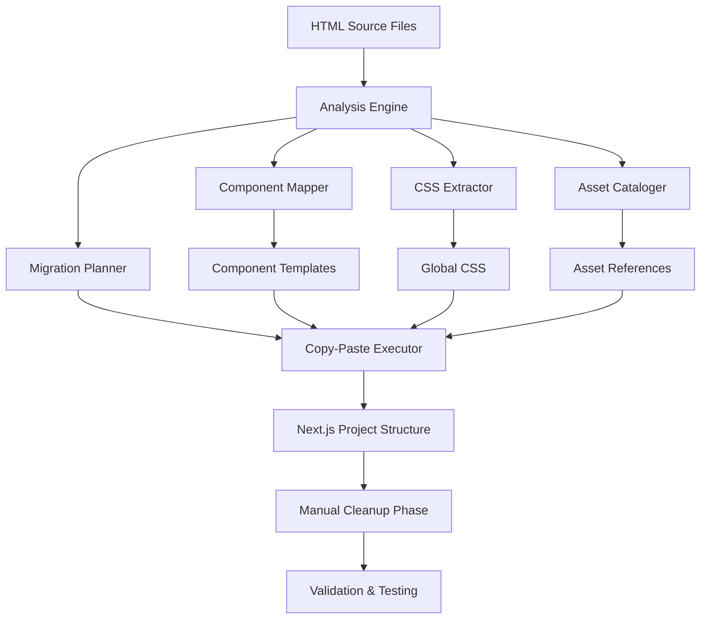

# Design Document: HTML to Next.js Migration System

## Overview

This design document outlines a systematic approach for migrating static HTML portfolio files to a Next.js application using a copy-paste methodology. The system prioritizes pixel-perfect preservation of the original design while converting to a modern React-based architecture.

The migration system operates on four main HTML files (index.html, Grid.html, inqueries.html, work.html) that represent a design portfolio website with complex Framer Motion animations, custom CSS, and interactive elements. The approach emphasizes terminal-based copy-paste operations to minimize transcription errors and maintain exact fidelity to the original implementation.

## Architecture

### High-Level Architecture



### System Components

1. **Analysis Engine**: Parses HTML files to identify structure, components, CSS blocks, and JavaScript sections
2. **Migration Planner**: Creates detailed execution plan with precise line numbers and copy commands
3. **Copy-Paste Executor**: Executes PowerShell commands to transfer content with exact fidelity
4. **Component Mapper**: Identifies reusable UI components and their boundaries
5. **CSS Extractor**: Consolidates all styling into a single global CSS file
6. **Asset Cataloger**: Inventories all external dependencies and assets

## Components and Interfaces

### Analysis Engine

**Purpose**: Parse and understand the structure of source HTML files

**Key Functions**:
- `analyzeHTMLStructure(filePath: string): HTMLAnalysis`
- `identifyComponents(htmlContent: string): ComponentMap[]`
- `extractCSSBlocks(htmlContent: string): CSSBlock[]`
- `findFramerMotionCode(htmlContent: string): AnimationBlock[]`

**Data Structures**:
```typescript
interface HTMLAnalysis {
  fileName: string;
  totalLines: number;
  cssBlocks: CSSBlock[];
  jsBlocks: JSBlock[];
  components: ComponentBoundary[];
  assets: AssetReference[];
}

interface CSSBlock {
  startLine: number;
  endLine: number;
  type: 'inline' | 'framer' | 'custom';
  content: string;
}

interface ComponentBoundary {
  name: string;
  startLine: number;
  endLine: number;
  startTag: string;
  endTag: string;
  isReusable: boolean;
}
```

### Migration Planner

**Purpose**: Generate precise execution plan with terminal commands

**Key Functions**:
- `createMigrationPlan(analyses: HTMLAnalysis[]): MigrationPlan`
- `generateCopyCommands(block: CSSBlock | ComponentBoundary): PowerShellCommand[]`
- `planRouteStructure(htmlFiles: string[]): RouteStructure`

**Command Generation**:
```typescript
interface PowerShellCommand {
  operation: 'extract' | 'create' | 'append' | 'cleanup';
  sourceFile: string;
  targetFile: string;
  startLine: number;
  lineCount: number;
  command: string;
}

// Example command generation
function generateExtractCommand(source: string, start: number, end: number): string {
  const lineCount = end - start + 1;
  const skipLines = start - 1;
  return `Get-Content "${source}" | Select-Object -Skip ${skipLines} -First ${lineCount} | Set-Content "temp_extract.txt"`;
}
```

### Copy-Paste Executor

**Purpose**: Execute migration commands with precision and error handling

**Key Functions**:
- `executeMigrationPlan(plan: MigrationPlan): ExecutionResult`
- `copyContentBlock(command: PowerShellCommand): boolean`
- `createComponentWrapper(htmlContent: string, componentName: string): string`
- `validateCopyOperation(source: string, target: string): boolean`

**Error Handling Strategy**:
- Continue execution despite React syntax incompatibilities
- Log all operations for rollback capability
- Validate content integrity after each copy operation
- Provide detailed error reports for manual cleanup

### Component Mapper

**Purpose**: Identify and extract reusable UI components from HTML structure

**Component Identification Logic**:
1. **Navigation Components**: Identify header/nav sections with consistent structure across pages
2. **Layout Components**: Extract common layout patterns (containers, grids, sections)
3. **Content Components**: Isolate discrete content blocks (project cards, info sections)
4. **Interactive Components**: Identify Framer Motion animated elements

**Component Extraction Process**:
```typescript
interface ComponentExtractionPlan {
  name: string;
  sourceFile: string;
  boundaries: ComponentBoundary;
  dependencies: string[];
  wrapperTemplate: string;
}

// Component wrapper template
const COMPONENT_TEMPLATE = `
export default function {COMPONENT_NAME}() {
  return (
    {EXTRACTED_HTML}
  );
}
`;
```

## Data Models

### Project Structure Model

```typescript
interface NextJSProjectStructure {
  app: {
    layout: ComponentFile;
    page: ComponentFile;
    globals: CSSFile;
    routes: {
      [routeName: string]: {
        page: ComponentFile;
        components?: ComponentFile[];
      };
    };
  };
  components: {
    [componentName: string]: ComponentFile;
  };
  public: AssetDirectory;
}

interface ComponentFile {
  path: string;
  content: string;
  dependencies: string[];
  sourceMapping: {
    originalFile: string;
    startLine: number;
    endLine: number;
  };
}
```

### Migration State Model

```typescript
interface MigrationState {
  phase: 'analysis' | 'planning' | 'execution' | 'validation' | 'complete';
  progress: {
    analyzed: string[];
    planned: string[];
    executed: PowerShellCommand[];
    validated: string[];
  };
  errors: MigrationError[];
  warnings: MigrationWarning[];
}

interface MigrationError {
  type: 'copy_failed' | 'syntax_error' | 'missing_dependency';
  file: string;
  line?: number;
  message: string;
  command?: string;
}
```

## Error Handling

### Expected Error Categories

1. **React Syntax Incompatibilities**
   - `class` attributes (should be `className`)
   - Self-closing tags missing `/>`
   - Inline styles as strings (should be objects)
   - Event handlers with incorrect casing

2. **Copy Operation Failures**
   - File access permissions
   - Incorrect line number calculations
   - PowerShell execution errors

3. **Dependency Issues**
   - Missing external assets
   - Broken import paths
   - Version compatibility problems

### Error Handling Strategy

```typescript
interface ErrorHandler {
  handleSyntaxError(error: SyntaxError, context: MigrationContext): void;
  handleCopyFailure(command: PowerShellCommand, error: Error): void;
  generateCleanupReport(errors: MigrationError[]): CleanupReport;
}

// Error tolerance approach
const ERROR_TOLERANCE_POLICY = {
  continueOnSyntaxErrors: true,
  logAllOperations: true,
  createBackups: true,
  generateManualFixList: true
};
```

## Testing Strategy

### Validation Approach

1. **Structural Validation**
   - Verify all HTML files were processed
   - Confirm all CSS blocks were extracted
   - Check component file creation
   - Validate route structure

2. **Content Integrity Validation**
   - Compare line counts before/after extraction
   - Verify CSS rule preservation
   - Check asset reference integrity
   - Validate Framer Motion code preservation

3. **Functional Validation**
   - Test Next.js build process
   - Verify route accessibility
   - Check component rendering
   - Validate styling application

### Testing Implementation

```typescript
interface ValidationSuite {
  structuralTests: StructuralTest[];
  contentTests: ContentTest[];
  functionalTests: FunctionalTest[];
}

interface StructuralTest {
  name: string;
  validate: (projectStructure: NextJSProjectStructure) => ValidationResult;
}

interface ContentTest {
  name: string;
  sourceFile: string;
  targetFiles: string[];
  validate: (source: string, targets: string[]) => ValidationResult;
}
```

### Manual Cleanup Checklist

The system will generate a comprehensive checklist for manual fixes:

1. **React Syntax Fixes**
   - Convert `class` to `className`
   - Add `/` to self-closing tags
   - Convert inline styles to objects
   - Fix event handler casing

2. **Import Statements**
   - Add React imports
   - Import Next.js components (Image, Link)
   - Add component dependencies

3. **TypeScript Compliance**
   - Add proper type annotations
   - Fix any type errors
   - Add component prop interfaces

4. **Next.js Optimizations**
   - Replace `` with `<Image>`
   - Replace `<a>` with `<Link>`
   - Add proper metadata
   - Optimize asset loading

## Correctness Properties

*A property is a characteristic or behavior that should hold true across all valid executions of a system-essentially, a formal statement about what the system should do. Properties serve as the bridge between human-readable specifications and machine-verifiable correctness guarantees.*

Based on the prework analysis and property reflection, the following correctness properties ensure the migration system operates correctly across all inputs:

### Property 1: Block Identification with Exact Line Numbers
*For any* HTML file with CSS or JavaScript blocks, the Migration_System should identify all blocks and return exact start and end line numbers that correctly encompass the complete block content.
**Validates: Requirements 1.1, 1.2**

### Property 2: PowerShell Command Generation Consistency
*For any* content extraction operation, the Migration_System should generate PowerShell Get-Content commands with correct Skip and First parameters that match the identified line boundaries.
**Validates: Requirements 3.1, 4.1, 5.1, 10.2**

### Property 3: Content Preservation Exactness
*For any* HTML content, CSS rules, JavaScript code, or markup attributes, the Migration_System should preserve the content exactly without modification, including whitespace, formatting, and special characters.
**Validates: Requirements 3.4, 4.3, 4.4, 5.2, 5.4, 7.4**

### Property 4: Line Count Calculation Accuracy
*For any* start and end line numbers, the Migration_System should calculate line counts using the formula (END - START + 1) and generate commands that extract exactly the specified range.
**Validates: Requirements 10.1**

### Property 5: Component Wrapping Consistency
*For any* extracted HTML segment, the Migration_System should wrap it in a proper React component template with correct export statements and TypeScript structure.
**Validates: Requirements 4.2, 4.5**

### Property 6: CSS Consolidation Order Preservation
*For any* set of CSS blocks from multiple sources, the Migration_System should consolidate them into a single file while maintaining the original order to preserve cascade specificity.
**Validates: Requirements 3.3, 3.5**

### Property 7: Error Tolerance Continuation
*For any* HTML content with React syntax incompatibilities (class attributes, self-closing tags, inline styles), the Migration_System should continue processing and preserve the content as-is for manual cleanup.
**Validates: Requirements 8.1, 8.2, 8.3, 8.4**

### Property 8: Asset Reference Preservation
*For any* HTML file with external dependencies (images, fonts, scripts, SVGs), the Migration_System should catalog and preserve all references exactly without modification.
**Validates: Requirements 7.1, 7.2, 7.3, 7.5**

### Property 9: Route Structure Mapping
*For any* HTML file in the source directory, the Migration_System should create a corresponding Next.js route with proper page.tsx structure and preserved navigation behavior.
**Validates: Requirements 6.2, 6.3, 6.4**

### Property 10: Validation Completeness
*For any* migration operation, the Migration_System should validate that all expected outputs were created, all content was copied successfully, and generate comprehensive reports of the migration status.
**Validates: Requirements 9.1, 9.2, 9.3, 9.4, 9.5**

### Property 11: Semantic Structure Analysis
*For any* HTML document, the Migration_System should identify all semantic sections and component boundaries accurately, creating a valid component hierarchy.
**Validates: Requirements 1.3, 1.5**

### Property 12: Dependency Cataloging Completeness
*For any* HTML file, the Migration_System should identify and catalog all external dependencies and assets without missing any references.
**Validates: Requirements 1.4**

### Property 13: Content Integrity Verification
*For any* copy operation, the Migration_System should verify that the copied content matches the source content exactly and provide rollback commands for each operation.
**Validates: Requirements 10.3, 10.5**

### Property 14: Temporary File Management
*For any* complex multi-step operation, the Migration_System should use temporary files appropriately and clean them up after successful completion.
**Validates: Requirements 10.4**

### Property 15: Documentation Generation
*For any* migration with syntax issues or manual fixes required, the Migration_System should generate comprehensive documentation listing all issues and required manual steps.
**Validates: Requirements 8.5**