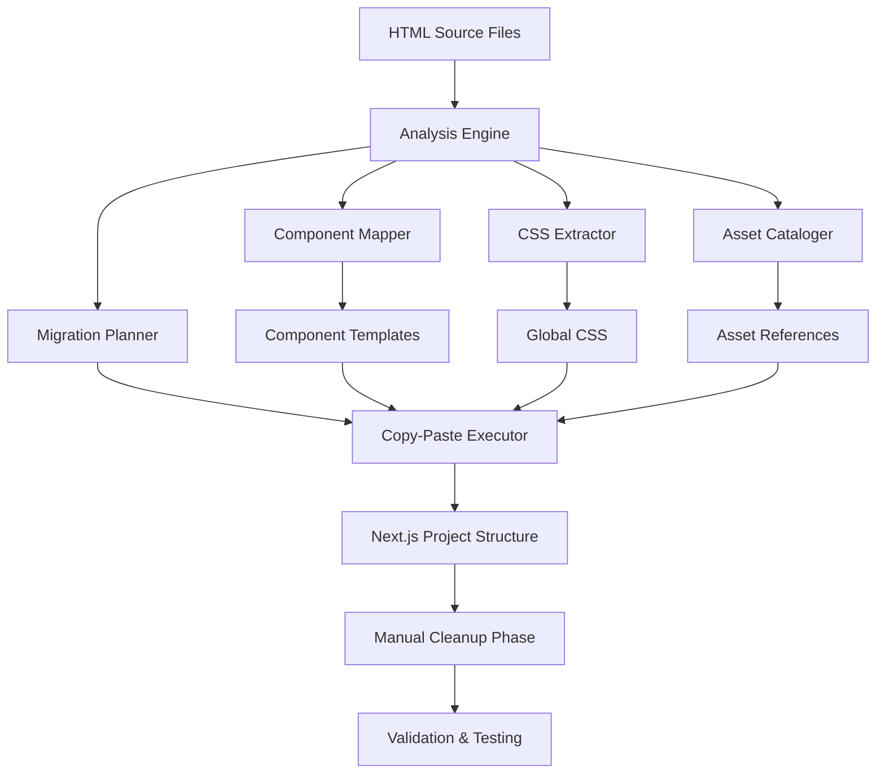

# Design Document: HTML to Next.js Migration System

## Overview

This design document outlines a systematic approach for migrating static HTML portfolio files to a Next.js application using a copy-paste methodology. The system prioritizes pixel-perfect preservation of the original design while converting to a modern React-based architecture.

The migration system operates on four main HTML files (index.html, Grid.html, inqueries.html, work.html) that represent a design portfolio website with complex Framer Motion animations, custom CSS, and interactive elements. The approach emphasizes terminal-based copy-paste operations to minimize transcription errors and maintain exact fidelity to the original implementation.

## Architecture

### High-Level Architecture



### System Components

1. **Analysis Engine**: Parses HTML files to identify structure, components, CSS blocks, and JavaScript sections
2. **Migration Planner**: Creates detailed execution plan with precise line numbers and copy commands
3. **Copy-Paste Executor**: Executes PowerShell commands with precision and error handling
4. **Component Mapper**: Identifies reusable components and their boundaries
5. **CSS Extractor**: Consolidates CSS from multiple sources into globals.css
6. **Asset Cataloger**: Inventories and maps all external assets and dependencies

## Components and Interfaces

### Core Data Structures

```typescript
interface HTMLAnalysis {
  filePath: string;
  totalLines: number;
  cssBlocks: CSSBlock[];
  jsBlocks: JavaScriptBlock[];
  componentBoundaries: ComponentBoundary[];
  assets: AssetReference[];
  metadata: FileMetadata;
}

interface CSSBlock {
  startLine: number;
  endLine: number;
  type: 'font-face' | 'global-styles' | 'component-styles' | 'media-queries';
  content: string;
  dependencies: string[];
}

interface ComponentBoundary {
  name: string;
  startLine: number;
  endLine: number;
  startTag: string;
  endTag: string;
  attributes: Record<string, string>;
  children: ComponentBoundary[];
  isReusable: boolean;
}

interface PowerShellCommand {
  command: string;
  description: string;
  sourceFile: string;
  targetFile: string;
  lineRange: { start: number; end: number };
}

interface MigrationPlan {
  projectStructure: ProjectStructure;
  cssConsolidation: CSSConsolidationPlan;
  componentExtractions: ComponentExtractionPlan[];
  routeMappings: RouteMapping[];
  powerShellCommands: PowerShellCommand[];
}
```

### Analysis Engine

```typescript
class AnalysisEngine {
  /**
   * Analyzes HTML file to identify structure and content blocks
   * @param filePath Path to HTML file to analyze
   * @returns Complete analysis of the HTML file structure
   */
  analyzeHTMLFile(filePath: string): HTMLAnalysis { ... }

  /**
   * Identifies CSS blocks with exact line numbers
   * @param content HTML file content as string array
   * @returns Array of CSS blocks with precise boundaries
   */
  identifyCSSBlocks(content: string[]): CSSBlock[] { ... }

  /**
   * Identifies JavaScript and Framer Motion blocks
   * @param content HTML file content as string array
   * @returns Array of JavaScript blocks with boundaries
   */
  identifyJavaScriptBlocks(content: string[]): JavaScriptBlock[] { ... }

  /**
   * Maps semantic HTML sections and component boundaries
   * @param content HTML file content as string array
   * @returns Hierarchical component structure
   */
  mapComponentBoundaries(content: string[]): ComponentBoundary[] { ... }
}
```

### Migration Planner

```typescript
class MigrationPlanner {
  /**
   * Creates a comprehensive migration plan from HTML analyses
   * @param analyses Array of HTMLAnalysis objects from all source files
   * @returns Complete MigrationPlan with all commands and mappings
   */
  createMigrationPlan(analyses: HTMLAnalysis[]): MigrationPlan { ... }

  /**
   * Generates PowerShell copy commands for content blocks
   * @param block CSS or Component block to generate commands for
   * @returns Array of PowerShell commands for copying the block
   */
  generateCopyCommands(block: CSSBlock | ComponentBoundary): PowerShellCommand[] { ... }

  /**
   * Plans the Next.js route structure based on HTML files
   * @param htmlFiles Array of HTML file paths
   * @returns Array of RouteMapping objects
   */
  planRouteStructure(htmlFiles: string[]): RouteMapping[] { ... }

  /**
   * Generates a PowerShell Get-Content command with precise parameters
   * @param source Source file path
   * @param start Starting line number (1-based)
   * @param end Ending line number (1-based)
   * @returns PowerShell command string
   */
  generateExtractCommand(source: string, start: number, end: number): string { ... }
}
```

### Copy-Paste Executor

```typescript
class CopyPasteExecutor {
  /**
   * Executes PowerShell commands with error handling and validation
   * @param commands Array of PowerShell commands to execute
   * @returns Execution results with success/failure status
   */
  executeCommands(commands: PowerShellCommand[]): ExecutionResult[] { ... }

  /**
   * Creates React component wrapper around HTML content
   * @param htmlContent Raw HTML content from copy operation
   * @param componentName Name for the React component
   * @returns TypeScript component file content
   */
  wrapInReactComponent(htmlContent: string, componentName: string): string { ... }

  /**
   * Validates that copy operations completed successfully
   * @param results Array of execution results
   * @returns Validation report with any issues found
   */
  validateCopyOperations(results: ExecutionResult[]): ValidationReport { ... }
}
```

## Data Models

### Project Structure

The Next.js project will follow this structure:

```
app/
├── layout.tsx              # Root layout with shared navigation
├── page.tsx                # Home page (from index.html)
├── globals.css             # Consolidated CSS from all HTML files
├── grid/
│   └── page.tsx            # Grid page (from Grid.html)
├── work/
│   └── page.tsx            # Work page (from work.html)
├── contact/
│   └── page.tsx            # Contact page (from inqueries.html)
└── components/
    ├── Navigation.tsx      # Shared navigation component
    ├── HeroSection.tsx     # Hero section component
    ├── ProjectGrid.tsx     # Project grid component
    └── ContactForm.tsx     # Contact form component
```

### CSS Consolidation Strategy

1. **Font Declarations**: Extract all @font-face rules (lines ~40-120 in each file)
2. **Global Styles**: Consolidate CSS reset and global styles (lines ~120-800)
3. **Component Styles**: Merge Framer-specific component styles (lines ~800-2800)
4. **Media Queries**: Preserve responsive breakpoints and media queries
5. **CSS Variables**: Maintain all CSS custom properties and tokens

### Component Architecture

The migration will create the following Next.js project structure with specific components:

#### Core Pages (app directory)
1. **app/page.tsx** - Home page (from index.html)
2. **app/grid/page.tsx** - Grid page (from Grid.html)  
3. **app/work/page.tsx** - Work page (from work.html)
4. **app/contact/page.tsx** - Contact page (from inqueries.html)
5. **app/layout.tsx** - Root layout with shared navigation
6. **app/globals.css** - Consolidated CSS from all HTML files

#### Reusable Components (app/components directory)
1. **Navigation.tsx** - Shared navigation component
   - Location: Lines 2920-2950 in all HTML files
   - Features: Sticky navigation, animated background, responsive behavior
   - Usage: Imported in layout.tsx for all pages

2. **HeroSection.tsx** - Home page hero component
   - Location: index.html lines 2950-3200
   - Features: Animated text reveals, SVG graphics, responsive typography
   - Usage: Used only in app/page.tsx

3. **ProjectGrid.tsx** - Grid layout component
   - Location: Grid.html main content section (lines 3046-3160)
   - Features: Project showcase grid, image galleries, hover animations
   - Usage: Used in app/grid/page.tsx

4. **ProjectShowcase.tsx** - Individual project display component
   - Location: work.html project sections (lines 3046-3379)
   - Features: Case study layouts, project presentations, interactive elements
   - Usage: Used in app/work/page.tsx (multiple instances)

5. **ContactForm.tsx** - Contact form component
   - Location: inqueries.html main content (lines 2946-2979)
   - Features: Form validation, contact information display, interactive elements
   - Usage: Used in app/contact/page.tsx

#### CSS Organization
- **app/globals.css** will contain:
  - Font declarations (@font-face rules from lines 40-118 in all files)
  - Global styles and CSS reset (lines 119-2569)
  - Component-specific styles (lines 2570-2852)
  - Framer Motion animation styles
  - Media queries and responsive breakpoints

#### Asset Management
- All external assets (Framer CDN images, fonts) will be preserved with original URLs
- No local asset migration required - all references maintained as external URLs
- Google Analytics and tracking scripts preserved in layout.tsx

## Correctness Properties

*A property is a characteristic or behavior that should hold true across all valid executions of a system-essentially, a formal statement about what the system should do. Properties serve as the bridge between human-readable specifications and machine-verifiable correctness guarantees.*

Now I need to use the prework tool to analyze the acceptance criteria before writing the correctness properties:

### Property Reflection

After reviewing all the testable properties from the prework analysis, I identified several areas where properties can be consolidated:

- Properties 1.1, 1.2, 1.3, and 1.4 all test the HTML analysis engine's parsing capabilities and can be combined into a comprehensive parsing property
- Properties 3.1, 4.1, and 7.1 all test PowerShell command generation and can be consolidated
- Properties 3.2 and 7.2 both test line number accuracy and calculation
- Properties 4.2 and 4.3 both test content preservation during component extraction

### Correctness Properties

Property 1: HTML Analysis Completeness
*For any* valid HTML file, the analysis engine should identify all CSS blocks, JavaScript blocks, semantic sections, and external assets with exact line numbers and correct boundaries
**Validates: Requirements 1.1, 1.2, 1.3, 1.4, 1.5**

Property 2: PowerShell Command Generation Accuracy
*For any* identified content block (CSS or HTML), the generated PowerShell commands should use correct Get-Content syntax with properly calculated Skip and First parameters
**Validates: Requirements 3.1, 4.1, 7.1, 7.2**

Property 3: CSS Consolidation Completeness
*For any* set of HTML files, all CSS blocks identified during analysis should be consolidated into a single globals.css file without loss of content
**Validates: Requirements 3.3**

Property 4: Component Extraction Fidelity
*For any* HTML component, the extraction process should preserve all data attributes, Framer-specific markup, and HTML structure while wrapping in proper React component syntax
**Validates: Requirements 4.2, 4.3**

Property 5: Route Structure Consistency
*For any* set of HTML files, the number of created page.tsx files should equal the number of input HTML files, with correct directory structure mapping
**Validates: Requirements 6.1, 6.2**

Property 6: Error Tolerance Preservation
*For any* copy-paste operation that introduces expected syntax errors (class vs className), the system should complete the operation successfully without failing
**Validates: Requirements 8.1**

Property 7: Migration Completeness Verification
*For any* migration operation, all components identified during analysis should appear in the final migration checklist
**Validates: Requirements 9.1**

## Error Handling

### Expected Errors and Tolerance

The system is designed to tolerate and expect certain types of errors that will be manually resolved:

1. **HTML-to-JSX Syntax Differences**
   - `class` attributes will need manual conversion to `className`
   - `for` attributes will need conversion to `htmlFor`
   - Self-closing tags may need adjustment
   - Event handlers will need camelCase conversion

2. **Framer-Specific Attributes**
   - `data-framer-*` attributes will be preserved as-is
   - Framer component types will be maintained
   - Animation configurations will be copied exactly

3. **CSS Variable References**
   - CSS custom properties will be preserved
   - Token references will be maintained
   - Media queries will be copied intact

### Error Recovery Strategies

1. **Validation Checkpoints**: After each major operation, validate that expected files exist
2. **Rollback Capability**: Maintain backup of original files during migration
3. **Progress Tracking**: Log each successful operation for recovery purposes
4. **Manual Intervention Points**: Clearly document where manual fixes are expected

## Testing Strategy

### Dual Testing Approach

The migration system will use both unit testing and property-based testing to ensure comprehensive coverage:

**Unit Tests**:
- Test specific PowerShell command generation with known inputs
- Verify CSS block identification with sample HTML files
- Test component boundary detection with predefined HTML structures
- Validate route mapping logic with known file sets

**Property-Based Tests**:
- Generate random HTML files and verify complete analysis coverage
- Test PowerShell command accuracy across various line ranges
- Verify CSS consolidation with multiple input sources
- Test component extraction fidelity with various HTML structures

### Property-Based Testing Configuration

- Minimum 100 iterations per property test
- Each property test references its design document property
- Tag format: **Feature: html-nextjs-migration, Property {number}: {property_text}**

### Testing Framework

The system will use **fast-check** for property-based testing in TypeScript, providing:
- Arbitrary HTML generation for comprehensive testing
- Shrinking capabilities to find minimal failing cases
- Configurable test iterations and timeout handling
- Integration with Jest for unified test execution

### Test Data Generation

**Smart Generators**:
- HTML files with realistic CSS block patterns
- Component structures with nested elements
- Asset references with various file types
- Line number ranges that reflect real-world HTML files

**Edge Case Coverage**:
- Empty HTML files
- Files with no CSS blocks
- Malformed HTML structures
- Very large files (4000+ lines)
- Files with special characters and encoding issues